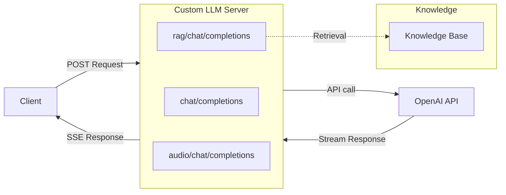
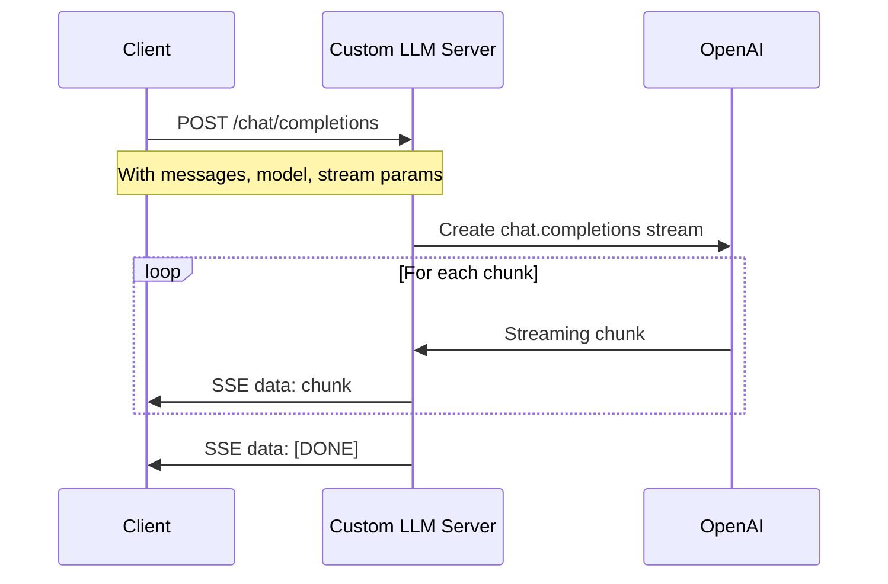
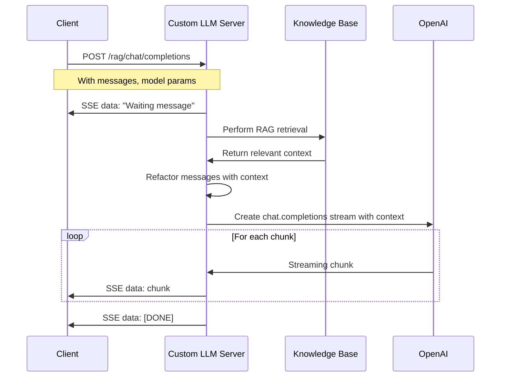
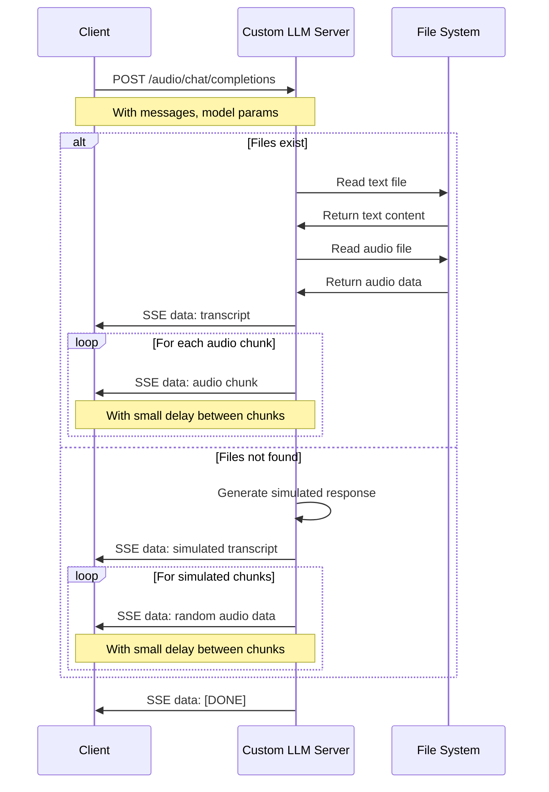

# 🌟 基于 Node.js 的自定义大语言模型示例代码

> 声网对话式 AI 引擎支持自定义大语言模型（LLM）功能，您可以参考此项目代码自定义实现大语言模型功能。

本文档是实现自定义大语言模型功能的 Express.js 示例代码

## 🚀 一、快速开始

### 1.1 环境准备

- Node.js 18+

### 1.2 安装依赖

```bash
npm install
```

### 1.3 配置

将 `env.example` 文件复制到 `.env` 并添加您的 OpenAI API 密钥：

```bash
cp env.example .env
```

编辑 `.env` 文件以添加您的 OpenAI API 密钥：

```
OPENAI_API_KEY=your-openai-api-key
```

### 1.4 运行示例代码

```bash
npm start
```

开发模式下自动重启：

```bash
npm run dev
```

当服务器运行时，您将看到以下输出：

```bash
INFO: Server running on port 8000
```

使用以下命令测试服务器：

```bash
curl -X POST http://localhost:8000/chat/completions \
  -H "Content-Type: application/json" \
  -H "Authorization: Bearer YOUR_OPENAI_API_KEY" \
  -d '{"messages": [{"role": "user", "content": "Hello, how are you?"}], "stream": true, "model": "gpt-4o-mini"}'
```

测试服务器时，我们建议使用如 [ngrok](https://ngrok.com/) 等隧道工具将本地服务器暴露到互联网。

## 🔄 二、架构和流程图

### 2.1 系统架构



关于三个 API 接口端点及其请求流程的更多详情，请参阅[请求流程图](#-四请求流程图)部分。

## 📖 三、功能说明

### 3.1 基本的自定义大语言模型

> 要成功接入声网对话式 AI 引擎，你的自定义大模型服务必须提供一个与 OpenAI Chat Completions API 兼容的接口。

`/chat/completions` API 端点实现基本的聊天补全功能。

### 3.2 实现检索增强的自定义大语言模型

> 如果您希望提高代理响应的准确性和相关性，可以使用检索增强生成（RAG）功能。这使您的自定义大模型能够从特定知识库中检索信息，并将检索结果作为上下文提供给大模型生成答案。

`/rag/chat/completions` API 端点展示了使用基于内存的知识存储库实现的简单 RAG 功能。

### 3.3 实现多模态的自定义大语言模型

> 多模态大语言模型可以处理和生成文本、图像和音频内容。

`/audio/chat/completions` API 端点模拟带有文本和音频数据块的音频响应。

## 📝 四、请求流程图

### 4.1 基本的大语言模型请求流程图



### 4.2 实现检索增强的大语言模型请求流程图



### 4.3 多模态音频大语言模型请求流程图



## 📚 五、相关资源

- 📖 查看我们的 [对话式 AI 引擎文档](https://doc.shengwang.cn/doc/convoai/restful/landing-page) 了解更多详情
- 🧩 访问 [Agora SDK 示例](https://github.com/AgoraIO) 获取更多教程和示例代码
- 👥 在 [Agora 开发者社区](https://github.com/AgoraIO-Community) 探索开发者社区管理的优质代码仓库

## 💡 六、反馈

- 🤖 如果您对示例项目有任何问题或建议，欢迎您提交 issue。

## 📜 七、许可证

本项目采用 MIT 许可证。
